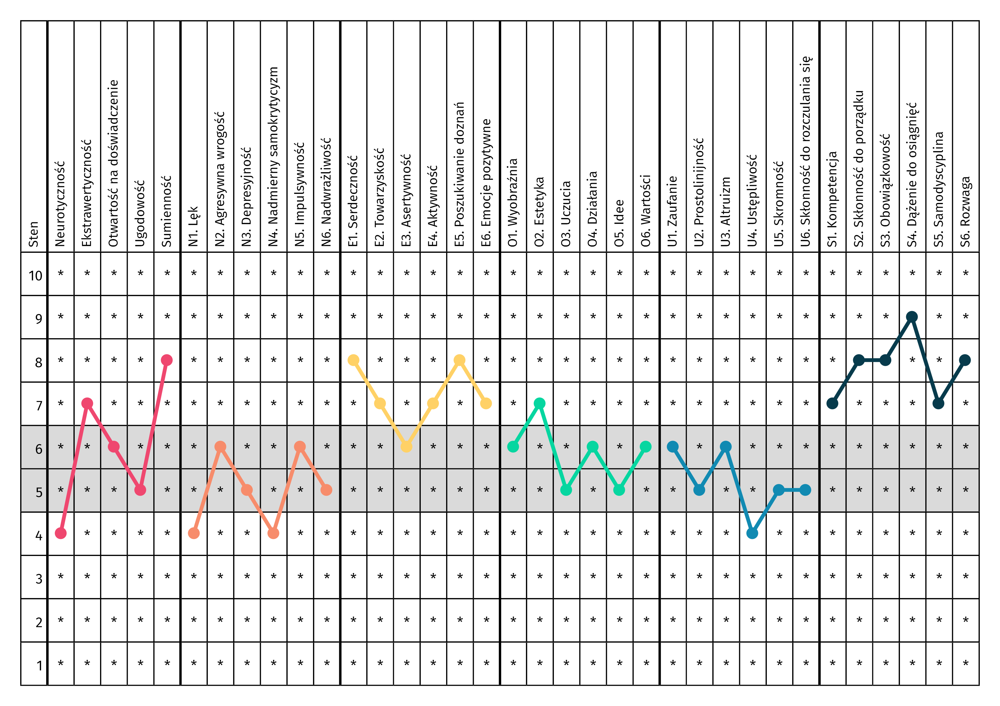

# NEO-PI-R Profile Generator

This simple Shiny app generates .png and .pdf files with personality profiles based on sten scores from the NEO-PI-R test (Costa & McCrae, [2008](https://doi.org/10.4135/9781849200479)). You can also download empty profile sheets to be printed.

## License

Released under [CC0](/LICENSE) by [@jakub-jedrusiak](https://github.com/jakub-jedrusiak).
